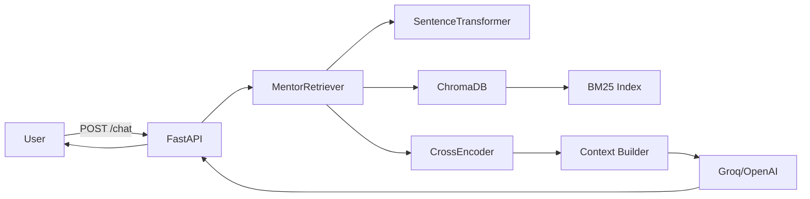
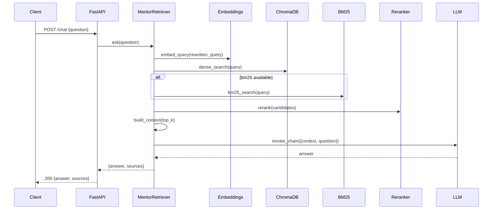

# 🧠 Mentor-X AI — Production README

> **AI-powered intelligent tutoring system** using Retrieval-Augmented Generation (RAG) to answer questions based on custom educational documents — built with hybrid retrieval, semantic caching, cross-encoder reranking, and a production-ready FastAPI backend.

---

## 📌 About This Project

Mentor-X AI is an advanced **Retrieval-Augmented Generation (RAG)** pipeline built for educational Q&A. It intelligently processes educational PDFs and creates a citation-aware Q&A assistant that:

- **Ingests** educational documents (PDFs), cleans, chunks, and deduplicates them intelligently
- **Embeds** text into vector space using local Sentence-Transformer models (no API cost)
- **Stores** vectors in a persistent ChromaDB vector database with embedding version verification
- **Retrieves** the most relevant document chunks via **Hybrid Retrieval** (Dense + BM25 + Reciprocal Rank Fusion)
- **Reranks** candidates using a CrossEncoder for precision
- **Generates** accurate, context-aware answers using Groq or OpenAI LLM backends
- **Caches** repeated queries with a semantic similarity cache to reduce latency
- **Serves** everything through a FastAPI REST API with streaming SSE support

Instead of relying solely on an LLM's training data, Mentor-X grounds all answers in your actual documents, ensuring accuracy and relevance.

---

## ✨ Key Features

| Feature | Description |
|---|---|
| 📄 **Smart PDF Processing** | Page-level extraction, regex cleaning, tiny-page filtering, and deduplication |
| ✂️ **Recursive Chunking** | `RecursiveCharacterTextSplitter` with configurable overlap for context preservation |
| 🧬 **Local Embeddings** | `sentence-transformers` (all-MiniLM-L6-v2) — 384-dim, fast, free, runs offline |
| 🗄️ **Persistent Vector Store** | ChromaDB with embedding model version verification on load |
| 🔀 **Hybrid Retrieval** | Dense (Chroma) + Sparse (BM25) fused via Reciprocal Rank Fusion (RRF) |
| 🎯 **Cross-Encoder Reranking** | Reranks top candidates for precision before context building |
| ⚡ **Semantic Cache** | In-process cache keyed by query embedding similarity — skips retrieval on hits |
| 🤖 **Dual LLM Support** | Groq (primary) + OpenAI (optional) via LangChain connectors |
| 🌊 **Streaming SSE** | `/chat/stream` endpoint streams tokens in real-time |
| 🛡️ **Prompt Injection Guard** | `_sanitize_question()` filters injection patterns, rejects with HTTP 400 |
| 📊 **Evaluation Suite** | Local metrics (exact match, token F1, faithfulness) + optional `ragas` integration |
| 🐳 **Containerized** | `Dockerfile` included for reproducible deployment |

---

## 🏗️ Tech Stack

| Component | Technology |
|---|---|
| **Language** | Python 3.10+ |
| **API Framework** | FastAPI + Uvicorn |
| **Orchestration** | LangChain |
| **Vector DB** | ChromaDB (persistent) |
| **Embeddings** | Sentence-Transformers (HuggingFace, local) |
| **Sparse Retrieval** | rank-bm25 (BM25Okapi) |
| **Reranker** | CrossEncoder (sentence-transformers) |
| **LLM** | Groq API (primary) / OpenAI (optional) |
| **PDF Processing** | PyPDF (PyPDFLoader) |
| **Rate Limiting** | slowapi |
| **Token Counting** | tiktoken (with char fallback) |
| **Containerization** | Docker |
| **Package Manager** | uv / pip |

---

## 📂 Project Structure

```
mentor-x-ai/
├── main.py                    # CLI entrypoint (--ingest, --api, --test, --reset)
├── requirements.txt           # Python dependency list
├── pyproject.toml             # Packaging metadata
├── uv.lock                    # Lockfile for uv dependency manager
├── .env.example               # Environment variable template
├── .gitignore
│
├── api/                       # REST API layer
│   ├── main.py                # FastAPI application and lifespan startup
│   └── routes.py              # Endpoints: /health, /chat, /chat/stream + auth/sanitization
│
├── config/                    # Centralized settings and runtime config
│   └── settings.py            # Chunking, embedding, LLM, cache, and threshold settings
│
├── dataIngestion/             # Document ingestion pipeline
│   ├── __init__.py
│   ├── pdf_processor.py       # PDF extraction, cleaning, chunking, deduplication
│   └── pdf_data/              # Sample PDFs for ingestion
│       └── attention.pdf
│
├── retrieval/                 # Core retrieval logic
│   ├── __init__.py
│   └── retriever.py           # HybridRetriever, SemanticCache, reranker, MentorRetriever.ask()
│
├── vectorStore/               # Vector database management
│   ├── __init__.py
│   ├── chroma_store.py        # ChromaDB wrapper and persistence logic
│   └── chroma_db/             # Persisted ChromaDB files (auto-created)
│
├── utils/                     # Shared utilities
│   ├── __init__.py
│   ├── models.py              # SingletonEmbeddings and CrossEncoder singletons
│   └── logging.py             # Logging setup for stdout + logs/api.log
│
├── evaluation/                # Evaluation framework
│   ├── __init__.py
│   └── evaluator.py           # Local heuristics and optional ragas integration
│
└── logs/                      # Runtime log directory (auto-created)
```

---

## ⚙️ Configuration

All settings are managed in `config/settings.py`:

```python
# PDF Chunking
CHUNK_SIZE = 800              # Characters per chunk
CHUNK_OVERLAP = 150           # Overlap between chunks for context
MIN_CHUNK_LENGTH = 100        # Filter out tiny chunks

# Embeddings
EMBEDDING_MODEL = "all-MiniLM-L6-v2"   # 384-dim, fast & free, runs locally
EMBEDDING_BATCH_SIZE = 32

# Vector Store
COLLECTION_NAME = "mentor_x_docs"
TOP_K_RESULTS = 5             # Dense retrieval candidates
FINAL_TOP_K = 3               # Chunks passed to LLM after reranking

# Retrieval
MIN_RELEVANCE_SCORE = 0.3     # Cross-encoder filter threshold
ENABLE_HYDE = false           # Hypothetical Document Embeddings (requires OpenAI)
MAX_CONTEXT_TOKENS = 3000     # Token budget for context window
MAX_CONTEXT_CHARS = 12000     # Char fallback budget

# LLM
LLM_MODEL = "llama3-8b-8192"  # Via Groq API
LLM_TEMPERATURE = 0.2         # Lower = more deterministic

# API
RATE_LIMIT = "20/minute"      # Per-IP rate limiting via slowapi
```

---

## 🛠️ Setup & Installation

### Prerequisites

- Python 3.10+
- pip or uv
- Groq API key — get one free at [console.groq.com](https://console.groq.com)
- (Optional) OpenAI API key for HyDE query rewriting

### 1️⃣ Clone & Navigate

```bash
git clone https://github.com/sobhyhassan/mentorX_v2-.git
cd mentorX_v2-
```

### 2️⃣ Create Virtual Environment

```bash
python -m venv .venv
```

### 3️⃣ Activate Environment

Windows PowerShell:
```powershell
.\.venv\Scripts\Activate.ps1
```

Mac / Linux:
```bash
source .venv/bin/activate
```

### 4️⃣ Install Dependencies

```bash
pip install -r requirements.txt
```

### 5️⃣ Setup Environment Variables

Copy the template and fill in your keys:

```bash
cp .env.example .env
```

```env
GROQ_API_KEY=your_groq_api_key_here       # Required — app raises if missing
OPENAI_API_KEY=your_openai_key_here       # Optional — enables HyDE query rewriting
MENTOR_API_KEY=your_secret_key_here       # Optional — enables X-API-Key header auth
```

---

## 🚀 Quick Start

### Step 1: Ingest a PDF

```bash
python main.py --ingest --pdf dataIngestion/pdf_data/attention.pdf
```

This will:
- ✅ Extract and clean pages via `PyPDFLoader`
- ✅ Split into chunks with `RecursiveCharacterTextSplitter`
- ✅ Filter tiny chunks and deduplicate exact matches
- ✅ Generate embeddings locally via `all-MiniLM-L6-v2`
- ✅ Persist vectors to ChromaDB

### Step 2: Start the API Server

```bash
python main.py --api
# or directly
uvicorn api.main:app --reload --host 0.0.0.0 --port 8000
```

Open **`http://127.0.0.1:8000/docs`** for interactive Swagger API docs.

### Step 3: Run with Docker

```bash
docker build -t mentor-x .
docker run -p 8000:8000 --env-file .env mentor-x
```

---

## 📊 Architecture

### System Architecture



### Request Sequence (POST /chat)



---

## 🔌 API Reference

### `GET /health`

Returns system readiness, uptime, vector store document count, and semantic cache metrics.

```json
{
  "status": "ok",
  "uptime_seconds": 142.3,
  "vector_store": { "document_count": 312 },
  "semantic_cache": { "hits": 5, "misses": 18 }
}
```

### `POST /chat`

**Request:**
```json
{ "question": "What is the attention mechanism?" }
```

**Optional header:** `X-API-Key: <your_key>` (if `MENTOR_API_KEY` is set)

**Rate limit:** 20 requests/minute per IP

**Response:**
```json
{
  "question": "What is the attention mechanism?",
  "answer": "The attention mechanism allows the model to...",
  "sources": [
    { "page": 3, "chunk": "...relevant excerpt..." }
  ],
  "response_time_ms": 834,
  "hallucination_flag": false
}
```

### `POST /chat/stream`

Server-Sent Events (SSE) — streams answer tokens in real-time. Final event contains `sources` and timing metadata.

---

## 🔄 Ingestion Workflow (Detailed)

1. `main.py --ingest` initializes `SmartPDFProcessor(chunk_size, chunk_overlap, min_chunk_length)`
2. Loads pages via `PyPDFLoader`, applies regex cleaning, filters pages with < 40 words
3. Splits pages into chunks using `RecursiveCharacterTextSplitter` with configured separators
4. Filters chunks shorter than `MIN_CHUNK_LENGTH` and deduplicates exact text matches
5. `VectorStoreManager.add_documents(chunks)` computes embeddings via `SingletonEmbeddings` and persists to ChromaDB

## 🔍 Retrieval Workflow (Detailed)

1. Normalize query; optionally apply HyDE rewrite via `_query_rewrite()` (requires OpenAI + `ENABLE_HYDE=true`)
2. Compute query embedding via `SingletonEmbeddings.embed_query()`
3. Check `SemanticCache.get(cache_key, query_embedding)` — return cached result on hit
4. On miss: `HybridRetriever.search()` runs dense Chroma search + BM25 sparse search, fuses with RRF
5. `_rerank()` scores candidates with CrossEncoder, normalizes, filters by `MIN_RELEVANCE_SCORE`
6. `_build_context()` selects `FINAL_TOP_K` chunks, enforces `MAX_CONTEXT_TOKENS` / `MAX_CONTEXT_CHARS` budget, deduplicates
7. Invoke LangChain `PROMPT | llm | parser` chain; run `_detect_hallucination()` heuristics on the answer

---

## 📈 Performance Metrics

| Metric | Value |
|---|---|
| Embedding Dimension | 384 |
| Embedding Model Size | ~22 MB |
| Embedding Inference | < 100ms per batch |
| End-to-end Query Time | ~800ms – 2s (LLM dependent) |
| Cache Hit Latency | < 50ms |
| Storage | ~50 MB per 100 pages |

---

## 🧪 Evaluation

Run evaluation using the built-in evaluator:

```bash
python main.py --evaluate
```

With a custom dataset:

```bash
python main.py --evaluate --dataset evaluation/sample_questions.json
```

**Available metrics:**
- `exact_match`, `token_f1`
- `faithfulness` (heuristic-based)
- `context_recall`, `context_precision`
- Full `ragas` suite (if `ragas` is installed)

---

## 🔒 Security Notes

- `GROQ_API_KEY` is **required** — `config/settings.py` raises on startup if missing. Never commit secrets to VCS.
- `MENTOR_API_KEY` optionally enables simple `X-API-Key` header authentication.
- Prompt injection is mitigated via `_sanitize_question()` regex filtering in `api/routes.py` — invalid requests return HTTP 400.
- TLS termination should be handled by an external proxy (nginx / cloud load balancer) in production.

---
